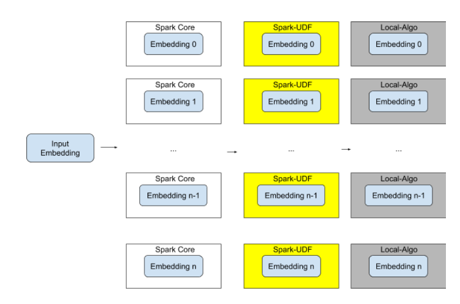

# Spark-knn
## Introduction
Use spark to find the k nearest neighbors or the approximate nearest neighbors.

## Highlights
### High-Speed
Our method is more than 2x faster than naive spark implementation of KNN algorithm, and over 30x faster than naive scala parallel implementation(using parArray). 
And also we can process bigger data. 

### High-Scalability
Our method provides a interface for users to utilize faster KNN algorithm on local machines(such as Faiss).
Originally Faiss can't run on Spark. But by using our method, we can combine the advantages of both Spark and Faiss.

### Usage
You can just copy our codes and find a proper position to paste it in your project.
See details in example.scala and comments in code.

### Architecture

### More Experiment Details on Speed
We set the length of embedding vector to 10, and then set the size of embedding dataset to 30000 and 300000 respectively. Here is the time-consuming result.
We test it on Databricks Notebook, the cluster is with 192 cores and 1.5T memory.

*Nan* means we can't get the result because it takes `too much` time.
